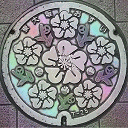

# レインボーgifメーカー
静止画像をレインボーにします  
Webアプリ版：https://youseegreen.pythonanywhere.com/rainbow_gif/

 


## Requirement
- Python (3以上)
- numpy
- python-opencv
- PIL

## How to use
rainbow.pyの__main__のパラメータをいい感じにセットして``` python rainbow.py ```を実行するだけ

## Others
- 波の式にベッセル関数など適用してもよさそう
- 彩度とかいい感じに上げたらもっとレインボーなりそう